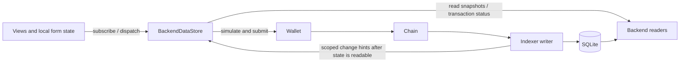

# Frontend state refactoring proposal

Status: discussion only; implementation requires approval. Inspected `main` at
`813e0c9f564ecc2b9cae4734d0472cfd49b4efca` on 2026-09-08. This PR changes documentation
only. It does not change application behavior, contracts, deployments, or trackers.

## Recommendation

Simplify the existing `BackendDataStore`, retaining one frontend owner for backend
data and pending actions. Remove its global request scheduler, competing writers
to shared data, and wallet-wide indexing lock. Keep the current wallet submission
path and backend transaction-status endpoint. Give the backend a precise
read-after-application guarantee before relying on it to finish actions.

The first implementation should not require Redux, Zustand, another query library,
a client revision protocol, optimistic gameplay updates, or a replacement indexer.
The current store already provides much of what we need. Centralized ownership
does not require putting every transport, action, and selector into one large file.

The previous eight-phase proposal is useful direction, but several of its premises
are already implemented, and several removals need stronger replacement guarantees.
The endpoint split and conflict policy below are proposals for discussion.

## Findings from the current code

These are code findings and local reproductions, not a claim to have traced a
specific production transaction. No live transaction was submitted for this review.

| Finding | Evidence | Consequence |
| --- | --- | --- |
| Deadlines start when requests enter a three-slot queue. | [`GameStateReadScheduler.schedule`](../apps/frontend/src/gameStateStore.ts#L57) | A healthy endpoint can time out without receiving a request. |
| A scheduled aggregate awaits children scheduled through the same pool. | [`walletPlanetSync` and `readWalletPlanetSync`](../apps/frontend/src/backendDataStore.ts#L2004) | Parent work consumes capacity needed by its children; multiple parents can exhaust it. The Overview and fleet child deadlines are only 2.5 and 1.2 seconds. |
| The transport clears its timer and removes abort forwarding after headers, before awaiting JSON. | [`fetchGameApiJsonUnpooled`](../apps/frontend/src/walletFlow.ts#L4981) | A stalled body can survive the transport deadline. The scheduler rejects its consumer but retains the occupied slot until that body settles. Removing the scheduler alone would leave the body read unbounded. |
| Overview and wallet synchronization publish into other query keys. | [`publishOverviewSnapshot` / `publishWalletPlanetSyncSnapshot`](../apps/frontend/src/backendDataStore.ts#L2090) | The aggregate's own generation check does not order it against a newer independent planets/queues response. |
| Many endpoints promote resource balances into another shared entry using block, log, request-generation, and source-priority comparisons. | [`promoteResourceState`](../apps/frontend/src/backendDataStore.ts#L1871), [`shouldPromoteCanonicalPlanetResources`](../apps/frontend/src/planetResourceStore.ts#L119) | Multiple field writers require frontend arbitration. This can be removed only after every consumer has one explicit field owner. |
| Pending recovery expires after 120 seconds and requires a decision. Any journal entry for a wallet diverts a new action into recovery. | [`resumePendingTransactions`](../apps/frontend/src/backendDataStore.ts#L1240), [`runWriteTransaction`](../apps/frontend/src/backendDataStore.ts#L1357) | A delayed or missing receipt can block unrelated actions indefinitely through repeated recovery decisions. The UI also derives a wallet-wide pending flag. |
| The journal is removed and success is published before post-application refresh completes. Refresh errors are caught as warnings. | [`runWriteTransaction`](../apps/frontend/src/backendDataStore.ts#L1436), [`transactionActionGate`](../apps/frontend/src/transactionActionGate.ts#L123) | A successful transaction can leave stale data visible without a durable obligation to finish updating it. Conversely, read failures must not relabel a successful chain transaction as reverted. |
| Every chain event invalidates the connected wallet and many global query kinds, without checking whether that wallet was affected. | [`connectChainEvents`](../apps/frontend/src/backendDataStore.ts#L819) | Other players' activity causes local reads. Per-key deduplication does not prevent bursts across many different keys. |
| Resume behavior is incomplete. Visibility flushes only tags already deferred by timers; recovery begins on wallet context changes or explicit retry. | [`handleVisibilityChange`](../apps/frontend/src/backendDataStore.ts#L1775), [`setContext`](../apps/frontend/src/backendDataStore.ts#L943) | No unified online/pageshow/reconnect resynchronization. Returning to a tab does not necessarily restart a timed-out transaction. |
| The shell subscribes to seven detail keys for every owned planet, even to render retained projections. | [`planetResourceKeys`](../apps/frontend/src/PlayableMvpApp.tsx#L3452) | “Refresh subscribed queries only” can still refresh many inactive planet details. Subscription demand must be intentional. |

Three temporary diagnostics against the unchanged source reproduced the first,
third, and fourth failure mechanisms:

1. A one-slot store starts a parent that awaits a child from that store. The child
   reaches its deadline with its loader invocation count still zero. The same
   dependency problem applies when all three production slots have parents.
2. Start Overview, then complete an independent planets request with value B.
   Complete the earlier Overview with value A. The planets entry becomes A again.
3. Return HTTP headers immediately but leave `response.json()` pending. After the
   configured transport timeout, the promise is still pending and its signal has
   not aborted. This isolates the timeout lifetime from server performance.

The temporary tests are outside the repository; no diagnostic or application code
is part of this PR. These are reproduction tests of current failures, not fixes.

## What already works and should be retained

- One store per normalized API URL, typed query descriptors, key subscriptions,
  same-key request sharing, last-good values, wallet cleanup, and trailing
  invalidation already exist. Simplify them rather than create a parallel store.
- UI components already avoid raw `fetch`, and most gameplay state comes from
  shared snapshots. Much remaining shell complexity is refresh orchestration,
  resource promotion, and compatibility setters that do nothing.
- Wallet sends already simulate exact calldata, verify the required network, and
  submit through EIP-1193. The store already persists the hash before confirmation.
- The active transaction path already uses backend status for both receipt and
  indexing observation. Custom receipt helpers in `walletFlow.ts` have no production
  callers found in this review. Deleting them is cleanup, not the primary fix.
- [`applyLog`](../apps/backend/src/indexer.ts#L4521) commits each log and its handler
  mutations atomically. Gameplay builders already use
  [`readConsistentSnapshot`](../apps/backend/src/indexer.ts#L1277).
- Infrastructure, Moon, Shipyard, Defenses, Overview, and fleet visibility already
  bypass route-level response caching. Some other wallet endpoints still use
  versioned caches. Avoid claiming all gameplay currently uses stale caching.
- There is already an immediate SSE `sync-status` event and periodic status
  emission after successful sync passes. Add an independent heartbeat and a
  browser connection-ready contract; neither should depend on a successful RPC poll.
- The low-level frontend GET response pool was already removed. The current
  architecture guide still describes that pool and other superseded behavior.
  Update that guide with implementation, without treating it as stronger evidence
  than the current source.

## Small target design

There are three responsibilities inside the existing data boundary: query entries,
pending actions, and refresh triggers. They may be small separate modules, with one
owner and no second store. Components own selections, forms, dialogs, and display
formatting. They dispatch named actions; an explicit Refresh button remains valid.

### Query lifecycle

Keep one entry per normalized API/chain/wallet/body/query identity, containing its
last accepted data, error, in-flight request, dirty flag, and active observers.
Include body kind so a planet and its moon cannot alias. Identity must also cover
filters and pagination. Runtime chain changes must retire the old context even
when the API URL is unchanged.

- Start a requested key immediately. Share an existing request for that key.
- Invalidation marks it dirty. If loading, schedule one trailing request when that
  request settles. Multiple invalidations within that load coalesce.
- Keep last-good data during loading or failure. A response invalidated while it
  was loading must not mark the entry fresh. Protect disposal/context replacement
  with request/entry identity; no frontend-visible backend revision is required.
- A mutation's awaited refresh must include the required trailing read; sharing a
  request started before `applied` is not sufficient. Current `invalidate()` returns
  before such trailing reads finish.
- Retain the existing short burst coalescing for SSE. A dirty flag limits concurrent
  reads, not the frequency of sequential reads under sustained event traffic.
- Put the single HTTP deadline around fetch **and body consumption**. Release all
  logical request state on failure; isolate a hung transport to its own key.
- Mark inactive keys stale and refresh on next use. Keep bounded cache retention.
  Do not count passive roster rendering as demand for every cached detail endpoint.
- Retry transient failures with bounded backoff while visible/online. Do not turn
  an unresolved dirty flag into a tight retry loop.

Remove global slots, priorities, queue deadlines, and scheduled parent aggregates.
Browser transport limits do not establish backend capacity; reduce duplicate work
and measure request counts, active requests, latency, and errors before/after.

### Data ownership and endpoint choices

The invariant is **one writer for every displayed gameplay field**. That does not
require a new endpoint for every field or one endpoint per tab.

| Option | Benefit | Cost / limitation |
| --- | --- | --- |
| Keep domain endpoints with one small planet-core owner for resources and planet queues. | Closest to current routes; heavy sections load only when used. Reuse an existing projection if it provides the required contract before adding a route. | Core and section reads are individually consistent, not atomically simultaneous. Every duplicate resource/queue field in section responses must be ignored as a writer, then removed when compatible. |
| One compact selected-planet snapshot containing resources, buildings, production, ships, and defenses. Separate wallet research, roster, and mission feeds. | Fewer requests and no cross-section merge logic for a planet; one consistent planet view. | More data per refresh and a slower section can delay the whole planet. Measure SQL work and payload sizes before choosing it. Do not reuse an unbounded all-planets/all-missions aggregate as the hot snapshot. |

My default is the incremental first option, preserving current endpoints while
making ownership explicit. Choose the second if coherent whole-planet updates are
more valuable than independently loading sections and the payload is small enough.
This decision should precede deleting the resource arbitration code.

For the first option, the proposed ownership is:

| Scope | Owner |
| --- | --- |
| Wallet roster, home identity, names | Roster/settlement projection; no authority over current resource balances |
| Planet resources and planet queues | One planet-core query, shared by top bar and sections |
| Building levels and infrastructure details | Infrastructure |
| Ships and ship production detail | Shipyard; shared queue values still come from core |
| Defenses and defense production detail | Defenses; shared queue values still come from core |
| Research levels and research queue | Wallet research; a selected planet may affect costs/eligibility but does not own a separate research queue |
| Moon resources, buildings, units, queues | Moon, explicitly keyed by parent planet and body kind |
| Missions | Existing wallet/global feeds, with explicit observer scopes |

Overview becomes a selector/composition of these owners, not another writer into
their keys. Cross-endpoint freshness is visible; action preflight remains necessary
even after a fresh read because another transaction can change chain state.

### Backend application guarantee

[`transactionStatusResponse`](../apps/backend/src/server.ts#L6972) currently checks
a successful receipt, a synced block at or beyond it, and indexed event count at
least equal to receipt log count. [`getTransactionReceipt`](../apps/backend/src/evm.ts#L3952)
already filters logs to indexed contract addresses; unrelated token logs are not
automatically a missing-count problem.

That is a useful starting point, but `applied` does not check the resource projection
watermark or endpoint availability. The normal sync pass
[emits its chain event](../apps/backend/src/chainSync.ts#L510) after log commits but
before specialized scans and publication of the fully indexed projection anchor.
An immediate refresh can therefore arrive while projections still fail closed.
The endpoint uses writer progress or diagnostics plus reader DB state, rather than
one durable proof of readable transaction effects.

Proposed contract:

1. `submitted` means no successful/reverted receipt has been observed yet; it is not
   proof the transaction is still in a mempool. An unavailable RPC returns a
   retryable error, not a fabricated lifecycle transition.
2. `confirmed` means a successful receipt exists in a canonical L2 block.
3. `applied` means the relevant receipt log identities and projections are committed,
   and a gameplay read begun afterward can observe them (or newer canonical state).
   Prefer the existing durable projection watermark/read transaction over another
   frontend protocol. Check log identities/block hashes, not counts alone where
   same-height reorgs can substitute different logs.
4. `reverted` is an unsuccessful canonical receipt. Receipt observation is not
   irreversible finality; keep the existing reorg repair and resynchronization.
5. In multiworker mode, test status on one reader followed by gameplay reads on a
   different reader. Every relevant cache must use committed invalidation/version
   information or be bypassed; clearing only the writer's memory is insufficient.
6. Gameplay unavailability must remain distinguishable from valid empty data.
   Review Moon's not-ready payload and other HTTP-200 stale payloads before using
   a generic query adapter that accepts every successful JSON response as fresh.

Move browser change hints to the point where the promised read model is readable.
They can batch committed changes and carry affected wallets/planets plus explicit
wallet-global scopes. Scope discovery must cover recipients, defenders, resource
transfers, research, moons, alliance effects, and changes without resource events.
An uncertain scope should invalidate conservatively; an incomplete scope is worse
than an occasional extra read. Keep old consumers compatible during migration.

### Transactions and recovery

Keep one frontend coordinator and the existing backend status path. Adding browser
receipt polling before backend polling is optional, not a prerequisite for fixing
stuck state. It adds another provider and lifecycle to recover. If independent
receipt visibility becomes a requirement, use the installed viem client rather
than custom receipt helpers, and preserve backend `applied` as the read-model gate.
The installed viem 2.52.0 implementation defaults to one confirmation and a
180-second timeout; the short snippet in the earlier proposal does not provide
unbounded recovery by itself. See [viem's receipt waiter source](https://github.com/wevm/viem/blob/viem%402.52.0/src/actions/public/waitForTransactionReceipt.ts).

Suggested lifecycle: awaiting wallet → submitted → confirmed/indexing → refreshing
affected data → done. Transport trouble leaves the known chain phase intact and
sets a retry condition. Rejection before a hash and a reverted receipt are separate
terminal outcomes. User-facing copy can remain “Processing…” through indexing.

- Persist `{ api/chain, wallet, hash, actionId, affectedScopes, submittedAt }`
  immediately after a hash. Enrich nonce/sender information afterward if unavailable;
  never delay initial persistence to fetch it. Keep in-memory recovery even if
  storage fails. Explicitly acknowledge that reload recovery cannot be guaranteed
  where the browser refuses persistent storage.
- Do not automatically resubmit. No age-based terminal timeout or recovery modal.
  Resume automatically on startup, foreground, online, pageshow, and reconnect.
  Use immediate status checks followed by capped backoff; pause while hidden/offline.
- Retain a durable refresh obligation after `applied` until required active data is
  refreshed. Inactive affected keys only need to be marked stale for their next read.
  Show delayed synchronization locally if data cannot refresh; do not claim the
  chain transaction failed or clear the last-good values.
- Serialize wallet prompts/submission. After the hash, lock only declared conflicts:
  initially the same planet's spendable resources/queues, wallet research for
  research actions, and both bodies for transfers. All same-planet spending conflicts
  while resources are unrefreshed; unrelated planet actions can proceed. Shared
  fleet slots and alliance operations need wallet-level locks where they actually
  conflict. This is not a reservation ledger or optimistic balance system.
- Scope recovery by chain and wallet, including writes still finishing during a
  wallet switch. Preserve another chain's pending record; the current wrong-chain
  recovery branch deletes it. Never send the same hash to a different chain's API
  and interpret its absence as a failure.
- Define replacement/cancellation handling before promising recovery for every hash.
  A greater confirmed sender nonce alone is not enough to claim the original failed:
  its receipt may be temporarily unavailable. Identify the canonical transaction
  using that nonce, distinguish repricing from cancellation/different calldata, and
  persist a replacement hash when appropriate. Without proof, remain unresolved
  with an unobtrusive explorer/status link. `superseded` is not currently implemented.
- Some current indexing plans do real follow-up work: paid-invite storage and
  referral claim recording. Preserve or move those idempotent operations with their
  own recovery semantics; do not delete them as if all plans were redundant reads.

### Realtime, time, and resynchronization

Use SSE as a low-latency invalidation hint. A ready event after listener registration
triggers a refresh of active queries; repeat on reconnect. Events during that refresh
set dirty and cause a trailing read. A heartbeat deadline detects an apparently open
but silent connection. Connection readiness and indexer readiness are distinct.

Do not make SSE the only route to fresh data. Backend as-of-now production and
[lazy contract settlement](../packages/contracts/src/VeydriftResourceReserves.sol#L38)
allow quantities/eligibility to change without a new transaction event at the moment
the UI needs them. See [`asOfNow.ts`](../apps/backend/src/asOfNow.ts) and the existing
fully indexed projection clock. Healthy SSE does not eliminate this requirement.

For the first implementation, prefer one modest visible-tab refresh loop for active
time-sensitive queries (start by measuring a 15-second cadence), with SSE providing
immediate change hints. The same loop is fallback recovery when SSE fails. Keep
countdowns local, but do not calculate authoritative resource/ship balances in the
browser. A more precise next-boundary timer is optional later if polling cost matters.
No background timer is required for correctness: every resume performs a fresh sync.

## Proposed implementation sequence, after approval

1. Fix transport body deadlines and remove scheduled parents/global slots, preserving
   the existing public store boundary. Turn the three reproduced failures into
   regression tests. No API redesign is necessary to start the transport fix.
2. Strengthen backend readable-application, cache, and event timing guarantees using
   the existing transaction/snapshot machinery. Preserve compatibility; deploy this
   before the frontend depends on the stronger semantics.
3. Implement the chosen field ownership, removing Overview fan-out and resource
   arbitration as their callers migrate. Use Infrastructure/top bar as the first
   complete slice, then the remaining sections and wallet shells.
4. Centralize persistent action recovery, conflict locks, and resume/poll behavior.
   Remove the decision modal only when automatic recovery and status visibility work.
5. Delete obsolete shell refresh effects, no-op setters, priority types, unused
   receipt helpers, and redundant indexing refresh plans. Preserve genuine follow-up
   writes. Update architecture documentation and behavioral tests together.

Each slice should leave one owner for migrated data. A temporary adapter may read
the new owner; it must not keep publishing into a second authoritative store.

## Verification and CI baseline

GitHub Actions remains the CI entry point. The current workflow routes PRs authored
by `backmeupplz` (also checking numeric user ID) to the repository variable
`VEYDRIFT_LOCAL_CI_RUNNER_LABELS=["veydrift-backmeupplz-ci"]`. The registered runner
is `veydrift-mac-backmeupplz-ci`; it was online during inspection. Main pushes use
GitHub-hosted runners. The latest main and preceding PR CI runs were successful.

This documentation-only PR should run the GitHub check but select no package jobs.
That is normal scoped CI, not evidence that all application tests passed.
[`ci-run-scoped-checks.mjs`](../scripts/ci-run-scoped-checks.mjs) runs frontend type
checking and the touch-browser test for frontend changes, but currently omits
`test:frontend`. Enabling that suite and fixing its stale fixtures should accompany
the implementation so the refactoring's regression coverage actually gates PRs.

Local inspection used Bun 1.3.9 and Node 25.2.1; CI requests Bun 1.1.42 and Node 24.

| Check on unchanged application source | Result |
| --- | --- |
| Frontend store, boundary, and resource-store tests (four files) | 86 passed, 0 failed |
| Backend server, chain-sync, indexer, and as-of-now tests (four files) | 508 passed, 0 failed |
| Temporary diagnostic tests reproducing current failures | 3 passed; they confirm the failures still exist |
| Full `bun run test:frontend` | 1,823 passed, 11 failed |

The full frontend failures are nine wallet/invite cases expecting Sepolia while
submission enforces Base Mainnet, one runtime-sensitive English date separator
assertion, and one deterministic battle simulation exceeding the five-second test
timeout. These occurred before any repository edit. The focused state suites passed.
The proposal does not weaken network checks or alter tests to conceal this baseline.

Required regression coverage for implementation:

- Many subscribers share one request; invalidation bursts produce one trailing read
  per in-flight interval; unrelated stalled headers/bodies cannot block another key.
- Old aggregate responses cannot overwrite a newer field owner; discarded
  API/chain/wallet/body contexts cannot publish; failed refreshes retain last-good data.
- An awaited post-application refresh waits beyond a pre-application in-flight read.
- Applied status followed by a read on another backend worker observes committed
  effects; no stale cache masks them; reorg/partial-log/projection-not-ready cases
  cannot falsely satisfy application. Check ready/event ordering and silent SSE loss.
- Transactions confirmed while hidden/offline recover on resume; reload never sends
  again; storage denial preserves in-memory recovery; wallet/chain switches preserve
  unrelated journals; reverted/repriced/cancelled transactions resolve correctly.
- A slow indexing transaction blocks conflicting actions only; independent actions
  remain usable. Refresh failure after applied is distinguishable from chain failure.
- Unrelated wallet events cause no gameplay reads. Time-based production changes
  still refresh with healthy SSE and without any new transaction events.
- Verify both playable and settlement roots, visible/error/empty states, and mobile
  wallet flows. Measure reads per action, peak simultaneous requests, response bytes,
  and receipt-to-visible-state delay; do not set an arbitrary performance target
  without baseline measurements.

## Decisions to brainstorm

1. Keep domain endpoints with an explicit core owner (my incremental default), or
   prefer one compact selected-planet snapshot for stronger cross-section coherence?
2. Keep backend-only confirmation (my default), or is independent browser receipt
   visibility important enough to justify a second observation path?
3. Accept a modest central visible-tab poll alongside SSE initially, or require a
   precise next-boundary refresh implementation from the first release?

The user must approve implementation; this proposal is not that approval.
