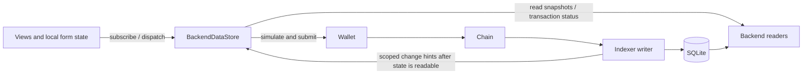

# Frontend state refactoring proposal, revision 2

Status: implementation approved and in progress on 2026-09-08. The findings below
describe the inspected baseline, `813e0c9f564ecc2b9cae4734d0472cfd49b4efca`.
This draft PR now includes the first implementation slice: independent single-flight
reads without the global scheduler, response-body transport deadlines, and a
loopback-only local backend/frontend setup. The transaction and ownership migration
described below is not complete yet. No contracts or production application deployment
have changed.

## Recommendation

Simplify the existing `BackendDataStore`, retaining one frontend owner for backend
data and pending actions. Remove its global request scheduler, competing writers
to shared data, and wallet-wide indexing lock. Keep the current wallet submission
path and backend transaction-status endpoint. Give the backend a precise
read-after-application guarantee before relying on it to finish actions.

The first implementation should not require Redux, Zustand, another query library,
a client revision protocol, optimistic gameplay updates, or a replacement indexer.
The current store already provides much of what we need. Centralized ownership
does not require putting every transport, action, and selector into one large file.

This revision incorporates the user's clarified requirements:

- Remove the pending-transaction decision popup completely. Users should not manage
  recovery records, choose whether to poll, or understand indexer internals.
- Run independent reads and post-submission action lifecycles concurrently.
- Make every write one complete frontend-owned operation, including preparation,
  submission, confirmation, indexer application, and the necessary data refresh.
- Remove obsolete code and refactor the shell as needed; preserving legacy callback
  interfaces is not a goal.
- Keep separate endpoints. Whole-planet snapshots are out of the initial scope and
  require evidence of acceptable backend cost, response size, and transfer volume.

These are the approved design requirements for the remaining migration.

## Findings from the current code

These are code findings and local reproductions, not a claim to have traced a
specific production transaction. No live transaction was submitted for this review.

| Finding | Evidence | Consequence |
| --- | --- | --- |
| Deadlines start when requests enter a three-slot queue. | [`GameStateReadScheduler.schedule`](../apps/frontend/src/gameStateStore.ts#L57) | A healthy endpoint can time out without receiving a request. |
| A scheduled aggregate awaits children scheduled through the same pool. | [`walletPlanetSync` and `readWalletPlanetSync`](../apps/frontend/src/backendDataStore.ts#L2004) | Parent work consumes capacity needed by its children; multiple parents can exhaust it. The Overview and fleet child deadlines are only 2.5 and 1.2 seconds. |
| The transport clears its timer and removes abort forwarding after headers, before awaiting JSON. | [`fetchGameApiJsonUnpooled`](../apps/frontend/src/walletFlow.ts#L4981) | A stalled body can survive the transport deadline. The scheduler rejects its consumer but retains the occupied slot until that body settles. Removing the scheduler alone would leave the body read unbounded. |
| Overview and wallet synchronization publish into other query keys. | [`publishOverviewSnapshot` / `publishWalletPlanetSyncSnapshot`](../apps/frontend/src/backendDataStore.ts#L2090) | The aggregate's own generation check does not order it against a newer independent planets/queues response. |
| Many endpoints promote resource balances into another shared entry using block, log, request-generation, and source-priority comparisons. | [`promoteResourceState`](../apps/frontend/src/backendDataStore.ts#L1871), [`shouldPromoteCanonicalPlanetResources`](../apps/frontend/src/planetResourceStore.ts#L119) | Multiple field writers require frontend arbitration. This can be removed only after every consumer has one explicit field owner. |
| Pending recovery expires after 120 seconds and requires a decision. Any journal entry for a wallet diverts a new action into recovery. | [`resumePendingTransactions`](../apps/frontend/src/backendDataStore.ts#L1240), [`runWriteTransaction`](../apps/frontend/src/backendDataStore.ts#L1357) | A delayed or missing receipt can block unrelated actions indefinitely through repeated recovery decisions. The UI also derives a wallet-wide pending flag. |
| The journal is removed and success is published before post-application refresh completes. Refresh errors are caught as warnings. | [`runWriteTransaction`](../apps/frontend/src/backendDataStore.ts#L1436), [`transactionActionGate`](../apps/frontend/src/transactionActionGate.ts#L123) | A successful transaction can leave stale data visible without a durable obligation to finish updating it. Conversely, read failures must not relabel a successful chain transaction as reverted. |
| Every chain event invalidates the connected wallet and many global query kinds, without checking whether that wallet was affected. | [`connectChainEvents`](../apps/frontend/src/backendDataStore.ts#L819) | Other players' activity causes local reads. Per-key deduplication does not prevent bursts across many different keys. |
| Resume behavior is incomplete. Visibility flushes only tags already deferred by timers; recovery begins on wallet context changes or explicit retry. | [`handleVisibilityChange`](../apps/frontend/src/backendDataStore.ts#L1775), [`setContext`](../apps/frontend/src/backendDataStore.ts#L943) | No unified online/pageshow/reconnect resynchronization. Returning to a tab does not necessarily restart a timed-out transaction. |
| The shell subscribes to seven detail keys for every owned planet, even to render retained projections. | [`planetResourceKeys`](../apps/frontend/src/PlayableMvpApp.tsx#L3452) | “Refresh subscribed queries only” can still refresh many inactive planet details. Subscription demand must be intentional. |
| Invalidation tags are matched with `some`, not as a combined filter. | [`invalidate`](../apps/frontend/src/backendDataStore.ts#L673) | Passing a wallet, planet, and kind matches the whole wallet OR that planet OR that kind. It does not mean “this kind on this wallet's planet.” |
| A building action uses a key such as `building:start:metalMine` while the write entry is scoped only by wallet. | [`runBuildingTransaction`](../apps/frontend/src/PlayableMvpApp.tsx#L5551), [`writeTransactionKey`](../apps/frontend/src/backendDataStore.ts#L1027) | Removing the wallet lock without changing action identity would allow actions on different planets to overwrite each other's progress. |
| Action preparation and progress translation still live in shell-specific wrappers. Fleet preparation awaits inventory before target protection. | [`runCoordinatedWriteTransaction`](../apps/frontend/src/PlayableMvpApp.tsx#L4432), [`runGalaxyTransaction`](../apps/frontend/src/PlayableMvpApp.tsx#L5869) | Independent prerequisites are serialized, and the store does not own the full operation from its first asynchronous step. |
| Indexed action effects can be broader than the clicked button. | [`_settleDuePlanet` and fleet settlement](../packages/contracts/src/VeydriftResourceReserves.sol#L38), [`research` / `shipyard` projections](../apps/backend/src/server.ts#L4322) | A write can settle ready queues/missions; research and fleet slots are wallet-wide dependencies. A hardcoded “building click refreshes buildings only” rule is incomplete. |

Three temporary diagnostics against the unchanged source reproduced the first,
third, and fourth failure mechanisms:

1. A one-slot store starts a parent that awaits a child from that store. The child
   reaches its deadline with its loader invocation count still zero. The same
   dependency problem applies when all three production slots have parents.
2. Start Overview, then complete an independent planets request with value B.
   Complete the earlier Overview with value A. The planets entry becomes A again.
3. Return HTTP headers immediately but leave `response.json()` pending. After the
   configured transport timeout, the promise is still pending and its signal has
   not aborted. This isolates the timeout lifetime from server performance.

A fourth diagnostic in revision 2 registered Shipyard on wallet A/planet 1,
Infrastructure on wallet A/planet 2, and Shipyard on wallet B/planet 3. Invalidating
`[wallet:A, planet:1, kind:shipyard]` refreshed all three. This confirms the scope
expansion at runtime, rather than assuming tags are conjunctive filters.

The temporary tests are outside the repository; no diagnostic or application code
is part of this PR. These are reproduction tests of current failures, not fixes.

## What already works and should be retained

- One store per normalized API URL, typed query descriptors, key subscriptions,
  same-key request sharing, last-good values, wallet cleanup, and trailing
  invalidation already exist. Simplify them rather than create a parallel store.
- UI components already avoid raw `fetch`, and most gameplay state comes from
  shared snapshots. Much remaining shell complexity is refresh orchestration,
  resource promotion, and compatibility setters that do nothing.
- Wallet sends already simulate exact calldata, verify the required network, and
  submit through EIP-1193. The store already persists the hash before confirmation.
- The active transaction path already uses backend status for both receipt and
  indexing observation. Custom receipt helpers in `walletFlow.ts` have no production
  callers found in this review. Deleting them is cleanup, not the primary fix.
- [`applyLog`](../apps/backend/src/indexer.ts#L4521) commits each log and its handler
  mutations atomically. Gameplay builders already use
  [`readConsistentSnapshot`](../apps/backend/src/indexer.ts#L1277).
- Infrastructure, Moon, Shipyard, Defenses, Overview, and fleet visibility already
  bypass route-level response caching. Some other wallet endpoints still use
  versioned caches. Avoid claiming all gameplay currently uses stale caching.
- There is already an immediate SSE `sync-status` event and periodic status
  emission after successful sync passes. Add an independent heartbeat and a
  browser connection-ready contract; neither should depend on a successful RPC poll.
- The low-level frontend GET response pool was already removed. The current
  architecture guide still describes that pool and other superseded behavior.
  Update that guide with implementation, without treating it as stronger evidence
  than the current source.

## Small target design

There are three responsibilities inside the existing data boundary: query entries,
pending actions, and refresh triggers. They may be small separate modules, with one
owner and no second store. Components own selections, forms, dialogs, and display
formatting. They dispatch named actions; an explicit Refresh button remains valid.
For example, a building component dispatches `startBuilding({ planetId, building })`.
It subscribes to the resulting action state rather than supplying send/indexing/
refresh callback trees. This is a set of ordinary typed functions, not a workflow
engine or a new action-description language.

### Query lifecycle

Keep one entry per normalized API/chain/wallet/body/query identity, containing its
last accepted data, error, in-flight request, dirty flag, and active observers.
Include body kind so a planet and its moon cannot alias. Identity must also cover
filters and pagination. Runtime chain changes must retire the old context even
when the API URL is unchanged.

- Start a requested key immediately. Share an existing request for that key.
- Invalidation marks it dirty. If loading, schedule one trailing request when that
  request settles. Multiple invalidations within that load coalesce.
- Keep last-good data during loading or failure. A response invalidated while it
  was loading must not mark the entry fresh. Protect disposal/context replacement
  with request/entry identity; no frontend-visible backend revision is required.
- A mutation's awaited refresh must include the required trailing read; sharing a
  request started before `applied` is not sufficient. Current `invalidate()` returns
  before such trailing reads finish.
- Retain the existing short burst coalescing for SSE. A dirty flag limits concurrent
  reads, not the frequency of sequential reads under sustained event traffic.
- Put the single HTTP deadline around fetch **and body consumption**. Release all
  logical request state on failure; isolate a hung transport to its own key.
- Mark inactive keys stale and refresh on next use. Keep bounded cache retention.
  Do not count passive roster rendering as demand for every cached detail endpoint.
- Retry transient failures with bounded backoff while visible/online. Do not turn
  an unresolved dirty flag into a tight retry loop.
- Recovery/invalidation refreshes use explicit active demand. A `useBackendDataQuery`
  with `enabled=false` must not remain an active refresh observer simply because
  its snapshot hook is mounted, as the current hook composition allows.
- Match refresh scope conjunctively: wallet AND optional body AND relevant kinds.
  Explicitly union multiple affected scopes. Do not retain the current OR matching
  of independent wallet, planet, and kind tags as the targeting mechanism.

Remove global slots, priorities, queue deadlines, and scheduled parent aggregates.
Browser transport limits do not establish backend capacity; reduce duplicate work
and measure request counts, active requests, latency, and errors before/after.

Parallelism is per independent key, not per currently selected planet. Infrastructure
on A, resources on B, and a mission feed start together. Each response publishes as
soon as it is ready; a shared `Promise.all` must not gate rendering all three. Batch
refresh bookkeeping may use `allSettled`, but query publication remains independent.
An actual dependency, such as discovering a first home planet before constructing
its query, still has to be awaited. That discovery must not hold a scheduler slot.

### Separate endpoints and explicit ownership

Keep domain endpoints. The invariant is **one writer for every displayed gameplay
field**, not one large response for the whole game or one endpoint per scalar.
Refine the earlier core proposal: keep the existing queues endpoint as the planet
queue owner rather than putting all queues into a new core payload. Core is only
the small shared resource/production/energy/storage view needed across sections.
Reuse an existing projection where possible; a dedicated lightweight route is
justified if obtaining these values otherwise loads an unrelated full section.

| Scope | Owner |
| --- | --- |
| Wallet roster, home identity, names | Roster/settlement projection; no authority over current resource balances |
| Planet resources, production rates, energy, and storage | One small planet-core query, shared by top bar and sections; no full unit lists, catalogs, missions, or all-planet fan-out |
| Planet building/ship/defense queues | Existing queues query keyed by planet; the wallet research queue is owned separately |
| Building levels and infrastructure details | Infrastructure |
| Ships and production details | Shipyard; shared queue values come from the queues owner |
| Defenses and production details | Defenses; shared queue values come from the queues owner |
| Research levels and research queue | Wallet research; a selected planet may affect costs/eligibility but does not own a separate research queue |
| Moon resources, buildings, units, queues | Moon, explicitly keyed by parent planet and body kind |
| Missions | Existing wallet/global feeds, with explicit observer scopes |

Overview becomes a selector/composition of these owners, not another writer into
their keys. Cross-endpoint freshness is visible; action preflight remains necessary
even after a fresh read because another transaction can change chain state.

The current research endpoint includes local lab/network eligibility as well as
wallet research levels and queue. Separate its shared wallet facts from its
planet-specific cost/eligibility projection. Keep a section's backend-derived costs
and availability local to that response; they must not become alternate writers of
shared raw resources, research levels, or queues. Do not invent a normalized entity
graph for every field merely to remove a few duplicated response properties.

Expected loading demand:

| Visible need | Queries |
| --- | --- |
| Infrastructure on A | Core A, queues A, Infrastructure A in parallel |
| Open Shipyard on A | Reuse existing core/queues; load Shipyard A independently |
| Load two visible planets | Both sets start in parallel, deduplicating any shared wallet query |
| Planet picker | Small roster, not seven live detail subscriptions per planet |
| Overview queue summaries | Roster plus necessary queue summaries, not every hidden unit catalog |
| Mission Control | Active visible mission feed; archive pages only when requested |

The current roster/Overview builders enrich every owned planet with tactical and
moon data (`indexedWalletPlanetsSnapshot`, `indexedWalletPlanetState`). They are not
automatically lightweight navigation APIs. Make a small roster projection if needed,
with explicit fields used by its consumers, while retaining legacy routes during
migration. Avoid an arbitrary `include=everything` query-shape framework.

No production payload-size or latency benchmark has been performed in this analysis.
The evidence is structural: Infrastructure reads buildings/ships/research, Shipyard
reads inventory/fleet slots/research, Defenses reads inventory/building levels, and
Research reads labs across planets. Combining them would perform and transfer work
that an individual section may not need. Keep snapshots deferred unless a bounded
comparison shows benefit for actual navigation and polling workloads. Measure
compressed bytes, SQL/CPU time, p50/p95 latency, and bytes/requests per visible minute;
a smaller request count alone is insufficient. Existing route-benchmark scripts can
be reused, but currently measure latency rather than response size.

### Backend application guarantee

[`transactionStatusResponse`](../apps/backend/src/server.ts#L6972) currently checks
a successful receipt, a synced block at or beyond it, and indexed event count at
least equal to receipt log count. [`getTransactionReceipt`](../apps/backend/src/evm.ts#L3952)
already filters logs to indexed contract addresses; unrelated token logs are not
automatically a missing-count problem.

That is a useful starting point, but `applied` does not check the resource projection
watermark or endpoint availability. The normal sync pass
[emits its chain event](../apps/backend/src/chainSync.ts#L510) after log commits but
before specialized scans and publication of the fully indexed projection anchor.
An immediate refresh can therefore arrive while projections still fail closed.
The endpoint uses writer progress or diagnostics plus reader DB state, rather than
one durable proof of readable transaction effects.

Proposed contract:

1. `submitted` means no successful/reverted receipt has been observed yet; it is not
   proof the transaction is still in a mempool. An unavailable RPC returns a
   retryable error, not a fabricated lifecycle transition.
2. `confirmed` means a successful receipt exists in a canonical L2 block.
3. `applied` means the relevant receipt log identities and projections are committed,
   and a gameplay read begun afterward can observe them (or newer canonical state).
   Prefer the existing durable projection watermark/read transaction over another
   frontend protocol. Check log identities/block hashes, not counts alone where
   same-height reorgs can substitute different logs.
4. `reverted` is an unsuccessful canonical receipt. Receipt observation is not
   irreversible finality; keep the existing reorg repair and resynchronization.
5. In multiworker mode, test status on one reader followed by gameplay reads on a
   different reader. Every relevant cache must use committed invalidation/version
   information or be bypassed; clearing only the writer's memory is insufficient.
6. Gameplay unavailability must remain distinguishable from valid empty data.
   Review Moon's not-ready payload and other HTTP-200 stale payloads before using
   a generic query adapter that accepts every successful JSON response as fresh.

Move browser change hints to the point where the promised read model is readable.
They can batch committed changes and carry affected wallets/planets plus explicit
wallet-global scopes. Scope discovery must cover recipients, defenders, resource
transfers, research, moons, alliance effects, and changes without resource events.
An uncertain scope should invalidate conservatively; an incomplete scope is worse
than an occasional extra read. Keep old consumers compatible during migration.

Add affected resource kinds to these internal hints, not just planet IDs. Both SSE
and the transaction-status response can derive the union of effects from existing
indexed transaction logs. This matters because a write can lazily complete other
queues or missions. Use the action's conservative declared effects until the
committed effects are available; recovery must not depend on catching its SSE event.

### Transactions and recovery

Keep one frontend coordinator and the existing backend status path. Adding browser
receipt polling before backend polling is optional, not a prerequisite for fixing
stuck state. It adds another provider and lifecycle to recover. If independent
receipt visibility becomes a requirement, use the installed viem client rather
than custom receipt helpers, and preserve backend `applied` as the read-model gate.
The installed viem 2.52.0 implementation defaults to one confirmation and a
180-second timeout; the short snippet in the earlier proposal does not provide
unbounded recovery by itself. See [viem's receipt waiter source](https://github.com/wevm/viem/blob/viem%402.52.0/src/actions/public/waitForTransactionReceipt.ts).

Suggested lifecycle: awaiting wallet → submitted → confirmed/indexing → refreshing
affected data → done. Transport trouble leaves the known chain phase intact and
sets a retry condition. Rejection before a hash and a reverted receipt are separate
terminal outcomes. User-facing copy can remain “Processing…” through indexing.

The frontend owns this entire lifecycle, including preparation before submission.
The backend answers what is confirmed and readable; it does not submit on the user's
behalf or host a new per-click orchestration worker. The existing indexer continues
to run while the browser is closed. Reload recreates the frontend observer from the
saved record and current backend state.

One ordinary action function does the following:

1. Capture immutable wallet/chain/body/arguments and register the action before its
   first await. Reject a duplicate/conflicting intent without starting another send.
2. Load independent required data in parallel. For a fleet launch, origin inventory
   and target protection can be requested together; evaluate the combined result.
3. Acquire the short wallet submission gate, recheck the captured account/network
   and required freshness, simulate exact calldata, and submit through EIP-1193.
   Do not allocate/manipulate EVM nonces in a new client nonce manager.
4. Save the returned hash immediately and release the submission gate. Independent
   submitted actions now wait for status concurrently, keyed by hash rather than
   running a sequential recovery loop keyed by wallet.
5. Observe backend status until `applied` or a proven terminal outcome. One status
   check can report already applied; do not restart a receipt phase after reload.
6. Invalidate actual affected queries and load the required ones in parallel. Await
   reads begun after application, including necessary trailing reads.
7. Finish required idempotent follow-up writes, publish completion, and release
   conflicts only after their required authoritative data is available.

For actions that remove a planet, moon, or queue, the expected absence is a valid
completion result. Their completion readers must target the surviving roster or
parent state rather than retry a deleted entity forever.

Always reload the small set of data required to complete the action, even if its
screen unmounted. Other affected data refreshes immediately only while actively
observed; inactive entries are marked stale. Unrelated feeds or one failed optional
refresh must not hold the action open. If a newly opened view needs affected data
during recovery, its query joins the same store lifecycle.

Backend-derived effects may expand invalidation beyond the action's initial planet.
They do not require locking every possible lazy side effect in advance: refreshed
preflight and contract execution remain the authority for cross-action races.

- Persist `{ api/chain, wallet, hash, actionId, affectedScopes, submittedAt }`
  immediately after a hash. Enrich nonce/sender information afterward if unavailable;
  never delay initial persistence to fetch it. Keep in-memory recovery even if
  storage fails. Explicitly acknowledge that reload recovery cannot be guaranteed
  where the browser refuses persistent storage.
- Do not automatically resubmit. No age-based terminal timeout or recovery modal.
  Resume automatically on startup, foreground, online, pageshow, and reconnect.
  Use immediate status checks followed by capped backoff; pause while hidden/offline.
- Retain a durable refresh obligation after `applied` until the small mandatory
  completion-read set is refreshed, even if unmounted. Other inactive affected keys
  only need to be marked stale for their next read.
  Show delayed synchronization locally if data cannot refresh; do not claim the
  chain transaction failed or clear the last-good values.
- Serialize wallet prompts/submission. After the hash, lock only declared conflicts:
  initially the same planet's spendable resources/queues, wallet research for
  research actions, and both bodies for transfers. All same-planet spending conflicts
  while resources are unrefreshed; unrelated planet actions can proceed. Shared
  fleet slots and alliance operations need wallet-level locks where they actually
  conflict. This is not a reservation ledger or optimistic balance system.
- Scope recovery by chain and wallet, including writes still finishing during a
  wallet switch. Preserve another chain's pending record; the current wrong-chain
  recovery branch deletes it. Never send the same hash to a different chain's API
  and interpret its absence as a failure.
- Define replacement/cancellation handling before promising recovery for every hash.
  A greater confirmed sender nonce alone is not enough to claim the original failed:
  its receipt may be temporarily unavailable. Identify the canonical transaction
  using that nonce, distinguish repricing from cancellation/different calldata, and
  persist a replacement hash when appropriate. Without proof, remain unresolved
  with an unobtrusive explorer/status link. `superseded` is not currently implemented.
- Some current indexing plans do real follow-up work: paid-invite storage and
  referral claim recording. Preserve or move those idempotent operations with their
  own recovery semantics; do not delete them as if all plans were redundant reads.

Use an action instance ID plus chain/wallet/body/action identity. The same building
upgrade on two different planets must produce two independent progress entries.
Associate each received hash with its instance; do not retain a single wallet-wide
progress entry as the source used to disable action buttons. Before-hash records
are not resubmittable jobs. Navigation after submission cannot cancel recovery or
retarget an action to the newly selected planet. A wallet/account/chain change
before submission must stop the unsubmitted intent unless its context is valid.

The only wallet-wide serialization is the short signing/submission critical section.
Data preparation runs outside it; confirmation/indexing/refresh run after release.
Do not silently queue later submissions for automatic execution after context changes.
Wallet nonce ordering remains a chain constraint: broadcasting B need not wait for
A's indexer refresh, but B cannot be promised to confirm before an earlier nonce.

| Example action | Minimum completion reads | Conflict scope |
| --- | --- | --- |
| Start building on A | Core A, queues A, Infrastructure A | Planet A spendable state/queues |
| Produce ships on B | Core B, queues B, Shipyard B | Planet B spendable state/queues |
| Start research from A | Core A, wallet research plus relevant lab eligibility | Planet A spendable state and wallet research |
| Launch from A | Origin core/inventory and wallet fleet state | Origin body and shared fleet slots |
| Transfer between bodies | Both affected core/inventory views | Both bodies, plus fleet slots if it is a fleet action |

This table describes minimal direct effects, not an exhaustive invalidation map.
Committed queue completion, research, mission, and other logs can add affected
queries. Research changes invalidate relevant cached cost/eligibility projections
across planets without eagerly fetching all of them.

### User-facing behavior: no recovery decisions

Remove `PendingTransactionRecoveryDialog`, its two buttons, recovery-decision state,
keep/discard handlers, dialog-specific formatting/styles, and tests that require the
popup. Do not replace it with a renamed decision dialog or technical toast sequence.

The initiating action shows “Awaiting wallet”, then “Processing…”, then the actual
result such as “Building upgrade started.” On reload, normal UI renders last-known
data and resumes known actions automatically. Conflicting controls show ordinary
pending state; navigation and independent actions work. A longer delay can show
“Taking longer than usual. We'll update this automatically.” next to the action.
Offline status can say “You're offline. We'll reconnect automatically.”

Real wallet rejection or contract failure remains actionable. Internal stages,
record age, indexer polling, and the decision to keep waiting are not user tasks.
An optional explorer/details link can exist for troubleshooting without requiring
users to use it. If a transaction is still genuinely unresolved, the relevant
conflict cannot be released solely because time passed. Prove replacement/reversion
or keep recovering; removing a popup must not permit a duplicate spend.

There is also an unavoidable submission-boundary distinction: a transport error or
page exit before a hash is returned does not prove no transaction was broadcast.
Never automatically retry that intent. Preserve available sender/nonce context and
attempt backend resolution when possible. Confirmed wallet rejection can be reported
as cancelled. Do not claim unconditional recovery from an unobservable hash handoff.

### Realtime, time, and resynchronization

Use SSE as a low-latency invalidation hint. A ready event after listener registration
triggers a refresh of active queries; repeat on reconnect. Events during that refresh
set dirty and cause a trailing read. A heartbeat deadline detects an apparently open
but silent connection. Connection readiness and indexer readiness are distinct.

Do not make SSE the only route to fresh data. Backend as-of-now production and
[lazy contract settlement](../packages/contracts/src/VeydriftResourceReserves.sol#L38)
allow quantities/eligibility to change without a new transaction event at the moment
the UI needs them. See [`asOfNow.ts`](../apps/backend/src/asOfNow.ts) and the existing
fully indexed projection clock. Healthy SSE does not eliminate this requirement.

For the first implementation, prefer one modest visible-tab refresh loop for active
time-sensitive queries (start by measuring a 15-second cadence), with SSE providing
immediate scoped change hints. Core balances are time-sensitive; queue/inventory
queries become time-sensitive while production is active. Buildings with a pending
completion must refresh too. Stable roster/catalog/archive data is event- or
navigation-driven while SSE is healthy. These rules live in the data module, not
component timers.

The same loop is fallback recovery when SSE fails, expanding to active mutable
queries. Pause it when hidden/offline. Transaction status observers have their own
per-hash backoff and do not wait for the generic polling tick; relevant chain hints
can prompt an immediate deduplicated status check. A recent successful explicit
refresh should satisfy a coincident polling tick, not cause another fetch.

Keep countdowns local, but do not calculate authoritative resource/ship balances in
the browser. A more precise next-boundary timer is optional later if polling cost
matters. No background timer is required for correctness: every resume performs a
fresh sync. A backend subscription outage and a healthy browser SSE transport are
different states; indexer readiness failures remain retryable.

## Approved implementation sequence

1. Fix transport body deadlines and remove scheduled parents/global slots, preserving
   the existing public store boundary. Turn the three reproduced failures into
   regression tests. No API redesign is necessary to start the transport fix.
2. Strengthen backend readable-application, cache, and event timing guarantees using
   the existing transaction/snapshot machinery. Preserve compatibility; deploy this
   before the frontend depends on the stronger semantics.
3. Implement separate-endpoint field ownership, removing Overview fan-out and resource
   arbitration as their callers migrate. Use Infrastructure/top bar as the first
   complete slice, then the remaining sections and wallet shells.
4. Centralize persistent action recovery, conflict locks, and resume/poll behavior.
   Remove the decision modal only when automatic recovery and status visibility work.
5. Delete obsolete shell refresh effects and action wrappers, no-op setters, priority types, unused
   receipt helpers, and redundant indexing refresh plans. Preserve genuine follow-up
   writes. Update architecture documentation and behavioral tests together.

Each slice should leave one owner for migrated data. A temporary adapter may read
the new owner; it must not keep publishing into a second authoritative store.
Replace tests asserting the old scheduler/popup/source strings with tests of the
required behavior; do not keep dead functions solely to satisfy those assertions.

## Verification and CI baseline

GitHub Actions remains the CI entry point. The current workflow routes PRs authored
by `backmeupplz` (also checking numeric user ID) to the repository variable
`VEYDRIFT_LOCAL_CI_RUNNER_LABELS=["veydrift-backmeupplz-ci"]`. The registered runner
is `veydrift-mac-backmeupplz-ci`; it was online during inspection. Main pushes use
GitHub-hosted runners. The latest main and preceding PR CI runs were successful.

The original documentation-only commits selected no package checks.
The implementation now selects frontend and backend checks.
[`ci-run-scoped-checks.mjs`](../scripts/ci-run-scoped-checks.mjs) runs frontend type
checking, the full frontend suite, and the touch-browser test for frontend changes.
The first implementation fixes the stale wallet-chain and locale fixtures so the
refactoring's regression coverage gates PRs.

Local inspection used Bun 1.3.9 and Node 25.2.1; CI requests Bun 1.1.42 and Node 24.

| Check on unchanged application source | Result |
| --- | --- |
| Frontend store, boundary, and resource-store tests (four files) | 86 passed, 0 failed |
| Backend server, chain-sync, indexer, and as-of-now tests (four files) | 508 passed, 0 failed |
| Temporary diagnostic tests reproducing current failures | Initial 3 passed; revision 2 added 1 passing invalidation-scope reproduction; they confirm the failures still exist |
| Full `bun run test:frontend` | 1,823 passed, 11 failed |

The full frontend failures are nine wallet/invite cases expecting Sepolia while
submission enforces Base Mainnet, one runtime-sensitive English date separator
assertion, and one deterministic battle simulation exceeding the five-second test
timeout. These occurred before any repository edit. The focused state suites passed.
The proposal does not weaken network checks or alter tests to conceal this baseline.

Required regression coverage for implementation:

- Many subscribers share one request; invalidation bursts produce one trailing read
  per in-flight interval; unrelated stalled headers/bodies cannot block another key.
- Old aggregate responses cannot overwrite a newer field owner; discarded
  API/chain/wallet/body contexts cannot publish; failed refreshes retain last-good data.
- An awaited post-application refresh waits beyond a pre-application in-flight read.
- Applied status followed by a read on another backend worker observes committed
  effects; no stale cache masks them; reorg/partial-log/projection-not-ready cases
  cannot falsely satisfy application. Check ready/event ordering and silent SSE loss.
- Transactions confirmed while hidden/offline recover on resume; reload never sends
  again; storage denial preserves in-memory recovery; wallet/chain switches preserve
  unrelated journals; reverted/repriced/cancelled transactions resolve correctly.
- A slow indexing transaction blocks conflicting actions only; independent actions
  remain usable. Refresh failure after applied is distinguishable from chain failure.
- Parallel same-action writes on different planets retain distinct progress. Several
  saved hashes recover concurrently. Navigation does not drop mandatory completion
  reads or cause recovery to submit against a new wallet/planet context.
- Scoped invalidation means wallet AND body AND kinds, never the old OR expansion.
  Disabled/passive observers do not trigger network work. Independent query results
  render without waiting for the slowest sibling; submission gates do not gate reads.
- Unrelated wallet events cause no gameplay reads. Time-based production changes
  still refresh with healthy SSE and without any new transaction events.
- Verify both playable and settlement roots, visible/error/empty states, and mobile
  wallet flows. Measure reads per action, peak simultaneous requests, response bytes,
  and receipt-to-visible-state delay; do not set an arbitrary performance target
  without baseline measurements.

## Current proposed direction

Separate endpoints, one small shared core, existing planet queues, ordinary typed
frontend actions owning their complete lifecycle, backend-owned receipt/application
facts, per-key parallel reads, per-hash parallel recovery, and no recovery-decision UI.
Retain a short wallet submission gate and real domain conflicts. Use scoped SSE and
demand-aware polling rather than fetching every planet section on every tick.

Whole-planet snapshots and independent browser receipt observation are deferred
unless measurement or a concrete product requirement justifies them. Removing dead
code and reshaping application modules are part of implementation, not optional
cleanup left behind after another compatibility layer.

The user approved implementation after this proposal. The PR remains a draft until
the migration and local testing are complete.
