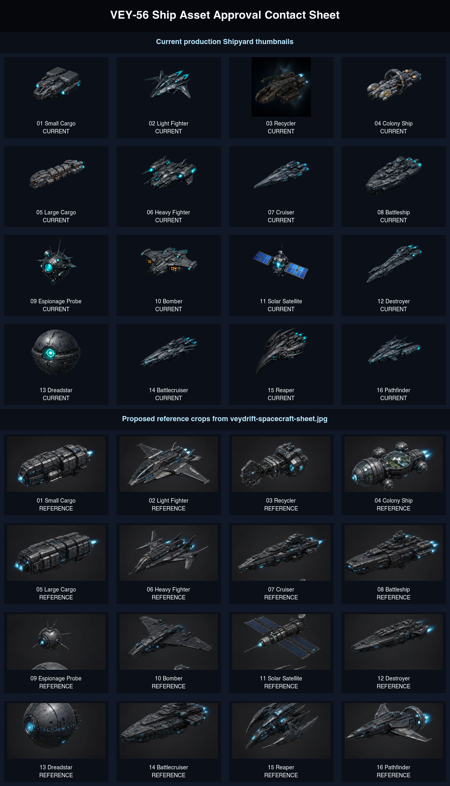

# VEY-KANEO-56 Ship Asset Review

This review is the approval gate before any Veydrift Shipyard ship model or asset replacement work.

Contact sheet:

## Scope

- Current production thumbnails are the 16 assets wired through `apps/frontend/src/gameAssets.ts`.
- Proposed references are cropped from `apps/frontend/public/assets/game/concepts/veydrift-spacecraft-sheet.jpg`.
- This change does not replace assets, change Shipyard code, or alter runtime mappings.
- Implementation should only begin after Nikita explicitly approves the mapping, rejects it, or provides replacement references.

## Approval Question

Please approve, reject, or edit the proposed mapping below before any ship asset replacement starts.

## Candidate Mapping

| Id | Ship | Current production asset | Proposed reference source | Crop/framing notes |
| --- | --- | --- | --- | --- |
| 01 | Small Cargo | `small-cargo.webp` | Concept sheet row 1, column 1 | Existing accepted high-res direction anchor also exists at `style-pass/high-res/small-cargo-alive-fullship-2k.webp`; confirm whether this should remain the anchor. |
| 02 | Light Fighter | `light-fighter.webp` | Concept sheet row 1, column 2 | Angular fighter silhouette; crop should preserve nose and wing tips with consistent padding. |
| 03 | Recycler | `recycler.webp` | Concept sheet row 1, column 3 | Utility/industrial front apparatus; needs extra horizontal padding to avoid clipping the collector arm. |
| 04 | Colony Ship | `colony-ship.webp` | Concept sheet row 1, column 4 | Spherical habitat silhouette; preserve dome and side modules. |
| 05 | Large Cargo | `large-cargo.webp` | Concept sheet row 2, column 1 | Larger cargo hull variant; should read distinct from Small Cargo by scale and hull length. |
| 06 | Heavy Fighter | `heavy-fighter.webp` | Concept sheet row 2, column 2 | Heavier fighter silhouette; crop should keep the long rear fins visible. |
| 07 | Cruiser | `cruiser.webp` | Concept sheet row 2, column 3 | Long capital-ship profile; use consistent side padding so it does not look smaller than combat peers. |
| 08 | Battleship | `battleship.webp` | Concept sheet row 2, column 4 | Heavy capital hull; crop should keep bow and engine glow inside frame. |
| 09 | Removed spy probe slot | Removed | Removed from Veydrift scope after VEY-KANEO-111. | No probe asset is shipped or referenced by the playable catalog. |
| 10 | Bomber | `bomber.webp` | Concept sheet row 3, column 2 | Wide bomber silhouette; crop needs enough vertical room for wing span. |
| 11 | Solar Satellite | `solar-satellite.webp` | Concept sheet row 3, column 3 | Satellite panels should remain fully visible and not be mistaken for a combat ship. |
| 12 | Destroyer | `destroyer.webp` | Concept sheet row 3, column 4 | Long narrow destroyer hull; needs consistent length scaling against Cruiser and Battleship. |
| 13 | Dreadstar | `deathstar.webp` | Concept sheet row 4, column 1 | Spherical superweapon; source crop is partly cut by the concept sheet edge and may need a dedicated replacement render. |
| 14 | Battlecruiser | `battlecruiser.webp` | Concept sheet row 4, column 2 | Large capital hull; crop should avoid bottom-edge clipping from the concept sheet. |
| 15 | Reaper | `reaper.webp` | Concept sheet row 4, column 3 | Distinct alien/sharp silhouette; crop should preserve both outer claws. |
| 16 | Pathfinder | `pathfinder.webp` | Concept sheet row 4, column 4 | Fast scout silhouette; source crop is close to the right/bottom edge and may need a dedicated replacement render. |

## Implementation Hold

Do not replace the current production assets until the approved mapping is recorded. After approval, implementation should:

- preserve the approved ship-to-asset mapping in the repo;
- normalize thumbnail framing across desktop and mobile Shipyard cards;
- include Shipyard screenshots in the final manual QA handoff.
